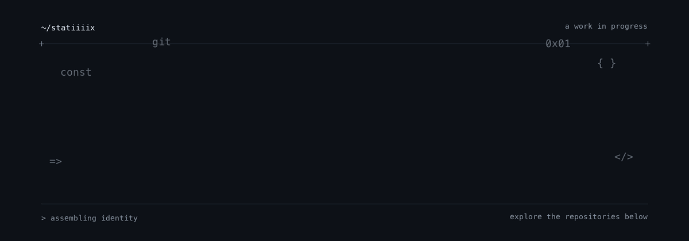

<picture>
  <source media="(prefers-reduced-motion: reduce) and (prefers-color-scheme: light)" srcset="assets/header-light.png">
  <source media="(prefers-reduced-motion: reduce)" srcset="assets/header-dark.png">
  <source media="(prefers-color-scheme: light)" srcset="assets/header-light.gif">
  
</picture>

  I like exploring ideas, making things, and refining them until they feel right.

  <a href="https://github.com/statiiiix?tab=repositories">Explore my repositories</a>
  &nbsp;·&nbsp;
  <a href="https://github.com/statiiiix?tab=stars">What inspires me</a>

---

### A little about me

This is my space for projects, experiments, and ideas in progress. Have a look around, and open an issue on a project if you want to talk about it.

### Find your way around

- **Projects:** [Browse everything I've published](https://github.com/statiiiix?tab=repositories)
- **Activity:** [See what I've been working on](https://github.com/statiiiix?tab=overview)
- **Collaborate:** Start a discussion or issue in the relevant repository.

Always curious. Always building.

